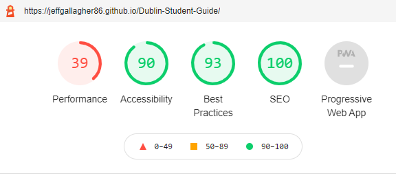

# Dublin Student Guide

Dublin Student Guide is a student travel website which is geared towards students coming from abroad or outside of the city to study in Dublin. 
Its main aim is to be a one stop shop for a student who is new to Dublin, providing info on transport, education, entertainment, food and drink!

[View Live Website Here](https://jeffgallagher86.github.io/Dublin-Student-Guide/)

# UX
## User Stories
---
### First Time user

As a user:

1. I want the design of the site to make a good impression on me.
2. I want to understand the purpose of the site.
3. I want to know how/why this site stands out from others in it's field.
4. I want to be able to easily navigate through the site.
5. As somebody who is new to Dublin i want to find out what is going on in the city and where to find it.
6. I want to find the social media accounts so i can see if they have the type of content i am interested in.
7. I want to find a map of Dublin so i can find my way around the city.

### Returning & Frequent User

1. I want to see what new content has been added to the site i.e transport updates, college news, restaurant reviews, pub ratings and gig listings.
2. I want to follow the company on social media.
3. I want to see which new features have been added to the site.
5. I want to be able to engage with the site owners to give feedback or request certain content.
6. I will use the map with the markers on the points of interest throughout the city.

### Site Owner

As the site owner:

1. I want to be able to maximise the amount of traffic on the website, the site is primarily focused on students who are new to the city,
but is also a handy guide for students from Dublin also. The aim is to have a broad enough scope to have as many users as possible without comprimising 
on our aim to provide clear information to people new to Dublin.
2. I want to be able to get as many customers to follow us across our socials and sign up for our newsletter with a view to growing a 
membership with a view to possibly providing premium content further down the line.
3. I want to be able to engage with users through our social media platforms so we can keep track of feedback to make an improvements necessary.
4. I want to be able to provide advice to users who get in contact through the form on the site.

___

# Design Choices

### Colour Scheme

Initially when it came to the colour pallette for the site i wanted royale blue/Navy and a light blue as they are the
traditional Dublin colours. I think that blue has a more urban and fresh feel to it as opposed to more gentle colours such as greens, yellows and orange tones.
I ended up going with a dark blue and white scheme as i feel it has a much cleaner look and provides a better contrast for readability.

Blue is often associated with calmness. It inspires trust, stability, security, intelligence, and reliability.

### Typography

I used Google fonts for the typography on this site. The font pairing i chose were Lobster and Raleway, I liked how Lobster stood out in the titles
and how the Raleway font balnce that out with a much more functional aesthetic.

[Google Fonts](https://fonts.google.com/): Lobster and Raleway

## Wireframes 

Here are my original wireframe mockups.

# Features

* Eye catching mobile first design.

* Easy to navigate.

* Hamburger menu for smaller screens, hamburger turns to X when active and menu fades in for a more modern website feel.

* Scroll to top button, allows users to scroll to the top of the page from anywhere on the screen as it's position is fixed.

* Links to external sites where users can discover more about the city.

* Integrated map with markers on a variety of places of interest in Dublin added with Google Maps API.

* Information request form which sends email to site owner through emailJS.

* Social Media links.

## Future Scope

* Introduction of more Google maps API feature to allow the user to add their own journey through the city.

* Detailed information about various places of interest in Dublin.

* Add different routes through maps for things such as Literary walks, pub crawls and sightseeing days out.

* Create a tagging system for each recipe which would link to recipes with similar tags.

* Subscription newsletter service.

* Build a large community with a view to organising social activities with users in conjunction with businesses and venues around the city.

# Technologies Used

## Languages Used

* [HTML](https://en.wikipedia.org/wiki/HTML5)
* [CSS](https://en.wikipedia.org/wiki/CSS)
* [Javascript](https://www.javascript.com/)

# Frameworks, Libraries, Programs and Sites.

* [Bootstrap](https://getbootstrap.com/) - used for the grid system and styling throughout the site.

* [jQuery](https://jquery.com/) - libraries used for Javascript on the site.

* [Google API](https://developers.google.com/apis-explorer) - used for the map with markers on the site.

* [EmailJS](https://getbootstrap.com/) - used for the grid system and styling throughout the site.

* [Web Formatter](https://webformatter.com/html) - used to format and clean up HTML, CSS and JS.

* [Photoshop](https://www.adobe.com/ie/products/photoshop.html) - for image editing.

* [Balsamiq](https://balsamiq.com/) - for wireframes.

* [tinypng](https://tinypng.com/) - to reduce the size of the images used.

* [favicon](https://favicon.io/) - for the favicon icons.

* [FontAwesome](https://fontawesome.com/) - for the icons used on the site.

* [Google Fonts](https://fonts.google.com/) - for the fonts used.

* [GitHub](https://github.com/) - to host and publish the site.

* [Gitpod](https://gitpod.io/) - Used for version control by utilizing the Gitpod terminal to commit to Git and Push to GitHub.

# Testing

## Code Validation

I used W3 Schools code validators for the HTML and CSS, and JSHint for the Javascript there are no errors in the HTML.

There were some unclosed div tags to fix in the HTML, which i have fixed and the only errors in the CSS are 
attributable to the use of bootstrap which i couldn't change. 

[w3 HTML Validator Results](https://validator.w3.org/nu/?doc=https%3A%2F%2Fjeffgallagher86.github.io%2FDublin-Student-Guide%2F)

[Jigsaw CSS Validator Results](https://jigsaw.w3.org/css-validator/validator?uri=https%3A%2F%2Fjeffgallagher86.github.io%2FDublin-Student-Guide%2F&profile=css3svg&usermedium=all&warning=1&vextwarning=&lang=en)

The JSHint results are as follows

---

## Lighthouse and Web Page test performance and accessibility Reports

I am happy with the results of my lighthouse performance accessibilty reports for both Desktop and Mobile respectively below, when i carrried out the tests the body font was
highlighted as not having enough contrast so i darkened the color slightly so that it would meet the requirements. I was unhappy to find such a low score on the mobile testing,
but on further investigation it looks like its the google API which is slowing it down, which couldnt be fixed unfortunately.

I also conducted a Web Page Performance test. I was pleased with the results noting that website security is something i need to look into going forward.

Tested the info contact form and the email functionality is working properly.

Additionaly i tested all external links, scroll to top button, hamburger toggler switch, map markers to show locations and responsiveness of site across all sizes and
all are working as intended.

# Deployment

## Publishing Project

This project was deployed to [GitHub](https://github.com/) pages as follows

1. Log-in to GitHub and open the repo for [Dublin Student Guide](https://github.com/jeffgallagher86/Dublin-Student-Guide)
2. Locate and click on the Settings button at the top of the page.
3. Scroll down and click the Pages option on the left panel.
4. Under "Source", click the dropdown called "None" and select "Master Branch".
5. The page will refresh.
6. Scroll down through the page to locate the now published site in the GitHub Pages section to retrieve the link.

## Cloning Project 

1. Log-in to GitHub and open the repo for [Dublin Student Guide](https://github.com/jeffgallagher86/milestone-project-1)
2. Locate and click on the code section at the top of the page.
3. Click the code button as shown below to show copy of URL

4. Open Git bash terminal.
5. Change the current working directory to the location where you want the cloned directory.
6. Type in "git clone" followed by the copied URL and press enter key to create a local clone.

# Credits

## Media

* All images used on site used with permiission from FlickR users.

## Code

* Fonts used courtesy of [Google Fonts](https://fonts.google.com/).

* Bootstrap used for grid system and styling throughout the site taken from [Bootstrap Docs](https://getbootstrap.com/).

* Icons used in site taken from [Font Awesome](https://fontawesome.com/).

* Some small snippets of code used from users on [Stack Overflow](https://stackoverflow.com/) and [YouTube]( https://www.youtube.com/watch?v=dJQedxalv64).

* Credit also goes to [w3Schools](http://w3schools.com/) for help along the way.

## Acknowledgements
* I would like to thank my mentor Akshat Garg for all his help with this project.

* I'd also like to thank all at Code Institute and the CI slack community for all their help along the way.

* Special mention for Anna Greaves for her README webinar also.

**Thank you very much for taking the time to review my work!**